## 
Webiste Name: [Dev To](https://dev.to/)


### 1. Task

        Target the Top description div and change the DEV Community to <Your_Name> and description to your passion

### Output

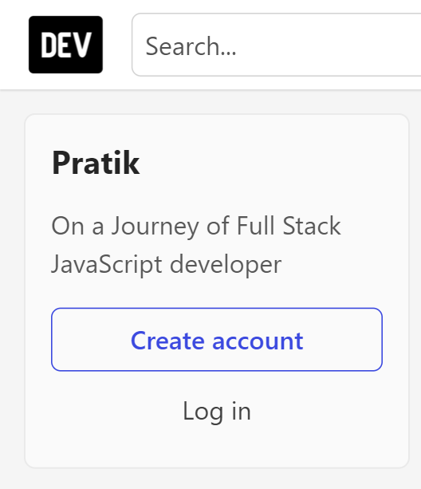


## 2. Website Name: [Apple](https://support.apple.com/en-in)

### Task
Fetch all the product name and store in an array


```
let productName = document.querySelectorAll(".as-imagegrid-item-title")

let x = [];

for(let i=0; i < productName.length; i++){
    x.push(productName[i].textContent)
    }
7
console.log(x)

```
### Output

VM9063:1 (7) ['iPhone Support', 'Mac Support', 'iPad Support', 'Watch Support', 'AirPods Support', 'Music Support', 'TV Support'] 

## 3. Webiste Name: [Youtube Support](https://support.google.com/youtube/)


### Tasks

     Add another FAQ 'My New FAQ' to the list

### Code
```
const faq = document.querySelector(".accordion-homepage");
const section = document.createElement("section");
section.className = "parent";

const faw = document.createElement("h3");

let txtNode = document.createTextNode("MY New FAQ");

faw.appendChild(txtNode);

section.appendChild(faw);
faq.appendChild(section);

```

### Output

-Dom-assignment-3.png)


## 4. Webiste Name: [OnePlus](https://www.oneplus.in/support)


### Sample Image


### Tasks

      Change the contact number

### code
```
4. document.querySelector(".customer-support a").innerText = "+91 1919191919"; 

```

### Output
    contact no. changw to 1919191919
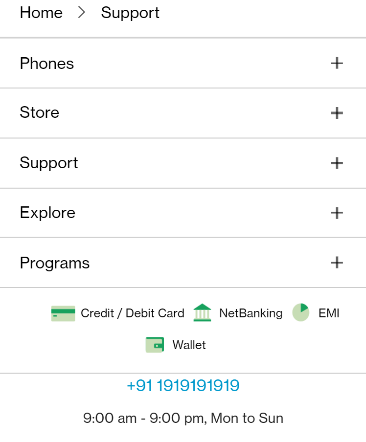


## 5. Webiste Name: [Samsung](https://www.samsung.com/in/offer/online/samsung-fest/)

### Tasks

     Target the main div of card and change the Button text to Check out
### Code
```

document.querySelector(".mytabs .diwali-deals-product-sale-pro .diwali-deals-product-sale-btn").innerText = "Check out".

```

### Output

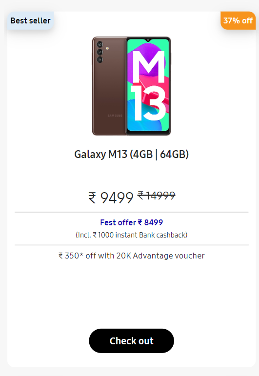


## 6. Webiste Name: [Adidas](https://www.adidas.co.in/)

### Tasks

     Target the search box and on hover change the background color to red.

### Code
```
const input = document.querySelector(".searchinput-wrapper___3YrvF form .searchinput___19uW0")

input.addEventListener("mouseenter", () => {input.style.backgroundColor = "Red"})

```
### Output

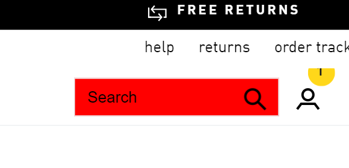


## 7. Webiste Name: [MDN Web Docs](https://developer.mozilla.org/en-US/)


### Tasks

     To Search a topic in the MDN Search bar.
     First add a text to search in the search bar and then hit the submit search button to search the docs using DOM

### Code
```
document.querySelector(".search-input-field").value = "Flexbox";

document.querySelector("form").submit();

```

### Output


## 8. Webiste Name: [Google](https://www.google.com/)

### Tasks

     Remove alternate languages from the home page languages listed

### Code
```
const ele = document.querySelector("#SIvCob");
const language = document.querySelectorAll("#SIvCob a");

for(let i = 0; i < language.length ; i++)
{
    if(i % 2 === 0) {
        ele.removeChild(language[i])
    }
};

```

### Output

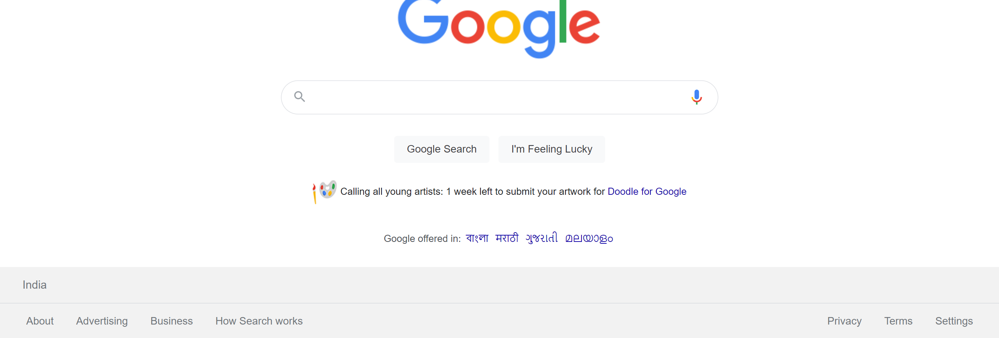


## 9. Webiste Name: [Code Wars](https://www.codewars.com/)

### Tasks

    Change the font family of the text to monospace and text color to the logo’s background color.

### Code
```
const head = document.querySelector(".content-width-extra-large .display-heading-1");

head.style.fontFamily = "monospace";

head.style.color = "#b1361e";

```
### Output

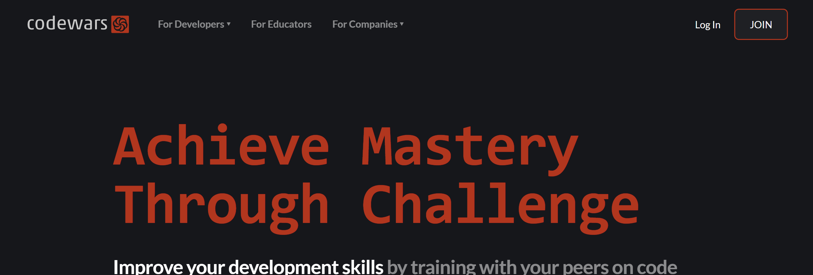


## 10. Webiste Name: [Freecodecamp](https://www.freecodecamp.org/)


### Tasks

    Target the button and change background colour on mouseover

### Code
```
10. const changeColor = document.querySelector(".row a");

changeColor.addEventListener("click/mouseover", (event) => {event.target.style.backgroundColor = "Red"});

```
### Output

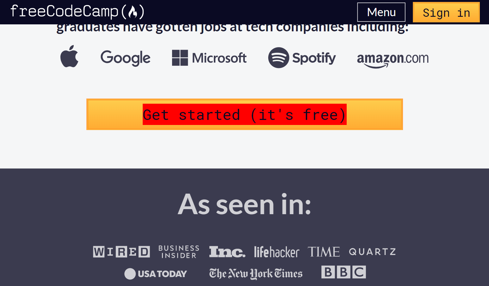

## 11. Webiste Name: [realme](https://www.realme.com/in/)

### Tasks

    change the realme logo to ineuron logo

### Code
```
document.querySelector(".wrapper .logo .icon-logo").style.backgroundImage = "url('https://learn.ineuron.ai/_next/image?url=%2Fimages%2Fineuron-

```
### Output

-Dom-assignment-11.png)


## 12. Webiste Name: [Github](https://github.com/)

### Tasks

     change the background colour of the button to blue.
### Code
```
 document.querySelector(".js-braintree-encrypt .btn").style.backgroundColor = "Blue"
```
### Output


## 13. Webiste Name: [Hackerrank](https://www.hackerrank.com/)


### Tasks

Target the top description and change “Matching developers with great companies” to ‘JSBOOTCAMP“.

### Code
```
document.querySelector(".fl-module-heading h1 span").innerHTML = "JSBOOTCAMP"

```
### Output

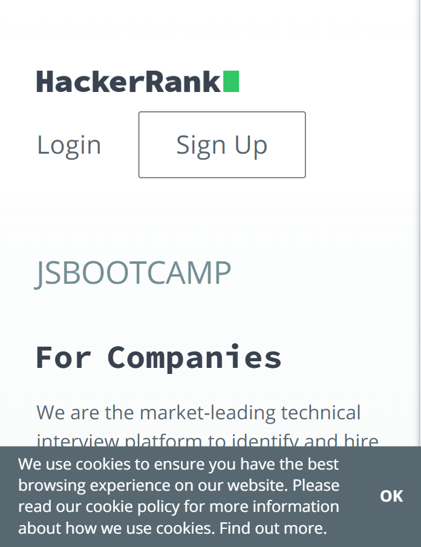

## 14. Webiste Name: [Asus](https://www.asus.com/in/)

### Tasks

       change the fontsize of “Hot Deals” to 80px
### Code
```
 document.querySelector(".HotDealsAll__HotCampaignsEventsContainer__FK0V2 .HotDealsAll__Heading__2fIbe").style.fontSize = "80px";

```
### Output

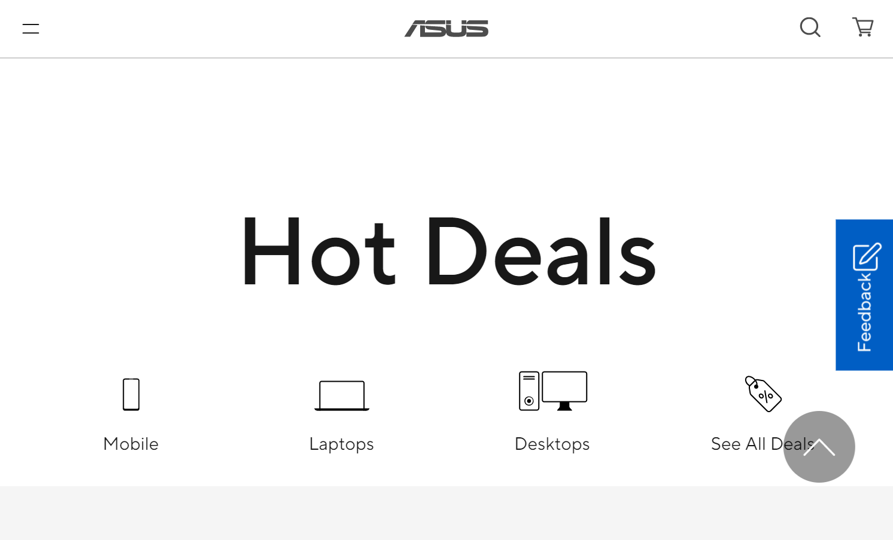

## 15. Webiste Name: [Dell](https://www.dell.com/en-in/shop/deals/laptop-deals?gacd=10415953-9016-5761040-285981356-0&dgc=ST&gclid=Cj0KCQjwguGYBhDRARIsAHgRm4-XUDMhhVNyHXb3s1gY4ZBzORr_d9Se-buhJwy7asyUe7YdqEA11eEaAt6UEALw_wcB&gclsrc=aw.ds&nclid=BxjBlpBQsX6pjSHh-L8YYSU77EpfXRkG1AGMB5Wbeu386ykspfrPDnfx_DdFau20)


### Tasks

       Convert the text “G15 Gaming Laptop” from left to right

### Code
```
 document.querySelector("#d560823win9b .ps-top .ps-title").style.textAlign = "Right";

```
### Output

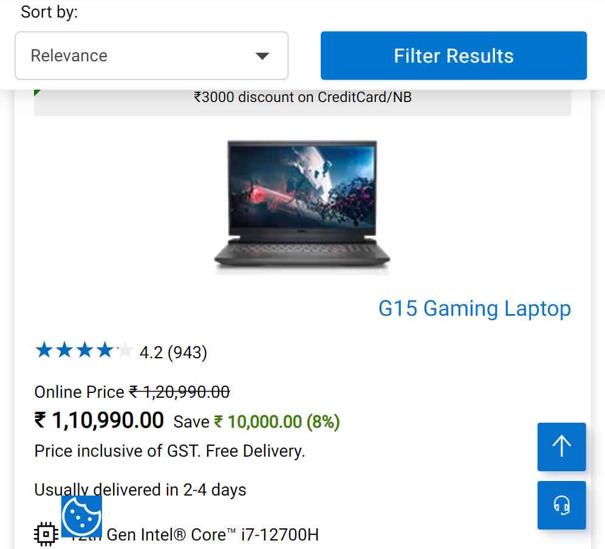

## 16. Webiste Name: [Vercel](https://vercel.com/)

### Tasks

      change the heading “Start with the developer” to “Start with Scratch”

### Code
```
document.querySelector(".jsx-499702677 h4").innerHTML = "Start with Scratch";

```
### Output


17. Webiste Name: [Sony](https://www.sony.co.in/)

### Tasks

     change the button text To current Date.

### Code
```
 document.querySelector(".btn-container a").innerHTML = date.toString();

```
### Output

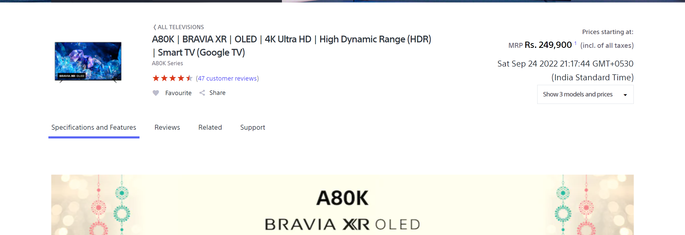


## 18. Webiste Name: [Philips](https://www.philips.co.in/)

### Tasks

    change the background colour blue to orange

### Code
```
document.querySelector(".p-f03-footer-container ").style.background= "Orange";
```
### Output

-Dom-assignment-18.png)


19. Webiste Name: [Canon](https://in.canon/)

### Tasks

    extract the canon logo

### Code
```
 const src = document.querySelector(".logo").src;

```
### Output
'https://in.canon/assets/brand/logo-300-002e45a4aec98fd92899838da9d5560f.png'


20. Webiste Name: [Oppo](https://www.oppo.com/in/)


### Tasks

      Change the description colour black to orange

### Code
```
document.querySelector(".wide .desc").style.color = "orange";
```
### Output

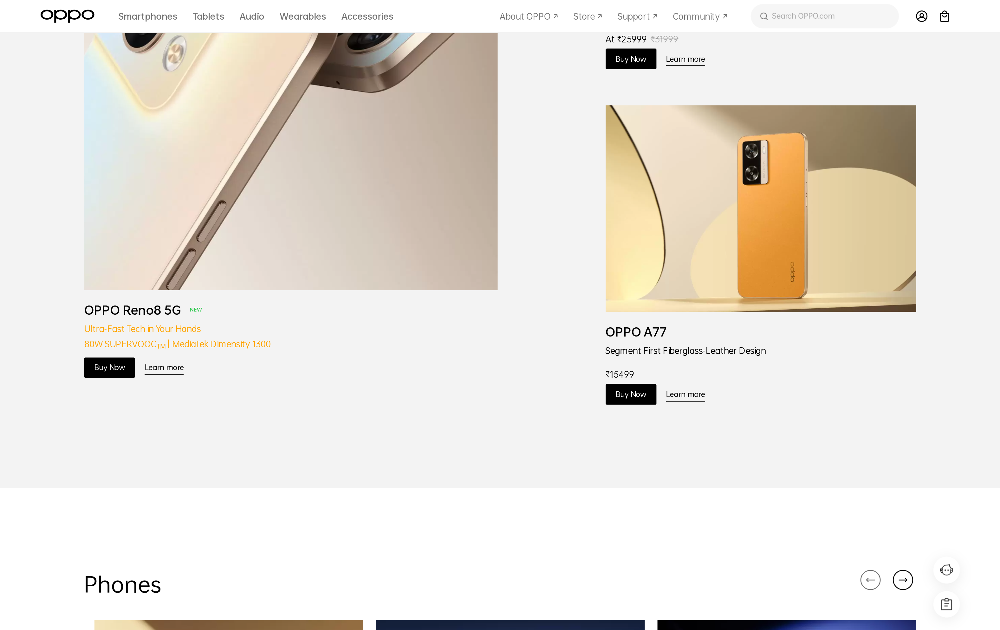
